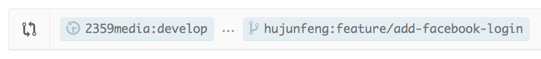

## Contributor Workflow

### Fork the Repo and Setup Upstream

These steps only need to be done once.

-   Fork the main repo on GitHub

    Go to https://github.com/organization/repo and click the "Fork" button.

-   Clone your own fork

    git clone https://github.com/user/repo.git

-   Add a remote linking to the main repo

        cd repo
        git remote add upstream https://github.com/organization/repo.git
        git fetch upstream

Now there are two remotes: origin and upstream. Origin points to your own
fork, and upstream points to the main repo.

    % git remote -v
    origin  https://github.com/user/repo.git (fetch)
    origin  https://github.com/user/repo.git (push)
    upstream  https://github.com/organization/repo.git (fetch)
    upstream  https://github.com/organization/repo.git (push)

### Pull Updates from Upstream

Suppose you're working on the develop branch of upstream
(upstream/develop). You will need to pull from upstream/develop to the
local develop branch.

-   **Don't work on the local develop branch directly**. Don't commit on this
    branch and don't merge any local branches into it.

-   Instead, only pull in changes from upstream

        git checkout develop
        git pull --rebase upstream develop

    And because we don't do commits and merges on the local develop, this
    pull command should only results in a fast-forward merge.

### Work on Feature Branches

-   Create a feature branch from develop

        git checkout -b feature/add-facebook-login develop

-   Work and add commits

        git add .
        git commit

-   When you finish the work, **before pushing it to origin**, pull upstream
    again to make sure that develop is updated, and rebase the feature branch
    onto develop

        git checkout develop
        git pull --rebase upstream develop
        git checkout feature/add-facebook-login
        git rebase develop

    So the feature branch will get latest updates from upstream/develop
    before being pushed. It reduces the possibility of conflicts when the
    maintainer merges the branch later.

-   Push the feature branch to origin (your repo)

        git push -u origin feature/add-facebook-login

    The `-u` option adds an upstream tracking reference to your local
    branch, meaning that you can run subsequent push or pull commands
    without having to specify the remote and branch names.

    **Don't rebase the feature branch onto develop after you push it to
    origin.**

### Create Pull Requests

-   Create a new pull request on GitHub

    You can create pull requests in several ways, the easy option is:

    -  Go to your own repo (https://github.com/user/Pull-Request-Test), select the
        newly created branch, then click the "Pull Request" button.

        Make sure the `base` and the `head` are correct. In our running
        example, the `base` is organization:develop and the `head` is
        user:feature/add-facebook-login. It should look like this:

        

    An email will be sent to the maintainer who will be doing code
    view.

### Continue Working When Pull Requests Being Reviewed

-   You can move on to another feature or issue by **creating a new
    feature branch from develop**,

        git checkout -b feature/add-twitter-login develop

-   If the new feature depends on an old feature, which pull request is
    not accepted yet, you can **create the new branch from the old feature
    branch**,

        git checkout -b feature/fetch-facebook-friends feature/add-facebook-login

    Later when you finish the new feature, **you're safe to create another
    pull request** for it. The maintainer would merge both pull requests
    (feature/add-facebook-login and feature/fetch-facebook-friends), and
    it won't cause any duplicate commits.

-   You may also continue to work on the feature branch that already has a pull
    request being submitted. For example, the maintainer might require some changes on
    your code before the pull request can be merged.

        git checkout feature/add-facebook-login
        // hard work in Xcode
        git add .
        git commit
        git push

    The new commits that are pushed to origin will automatcally appear
    in the original pull request on GitHub.

    But please note that **don't rebase the feature branch onto develop
    at this point, because you have already pushed it to origin.**

### Tidy Up Pull Requests

-   Once the pull request is accepted and merged, you can delete the
    branch

        git push origin --delete feature/add-facebook-login
        git branch -d feature/add-facebook-login

    The maintainer could also delete the remote branch on your own
    fork. If that is the case, you need to delete the [remote-tracking](http://www.gitguys.com/topics/tracking-branches-and-remote-tracking-branches/)
    branch in your local repo.

        git fetch --prune

    or

        git remote prune origin

-   Pull the changes from upstream again

        git pull --rebase upstream develop

-   Rebase other unpublished branches onto the updated develop branch

        git checkout feature/add-twitter-login
        git rebase develop

### Pull Request Message

A pull request message is to give the maintainer a brief idea of what
this pull request is about and help him or her to better understand the
changes you made. It also serves as a README document of the pull
request when it being surveyed in future. Therefore, it's important to
write a good pull request message, as the same as writing a good commit
message.

A good pull request message should at least contain:

-   A short, one line summary of the changes.

-   More detailed explanation. Ask yourself these questions as if
    you're the reviewer:

    -   If it's a new feature, what is this feature? How do you
        implement it? Is it completed in this pull request?

    -   If it's a bug fix, then what is the bug? What is the cause of
        the bug? How do you fix the bug? How can your solution prevent
        similar bugs from happening in the future?

    -   If it's code refactoring, why does the old code need to
        refactor? How is the new code better than the old one?

    It could have multiple paragraphs, if neccessary.

-   Links to the related stories in Pivotal Tracker.

## Maintainer Review and Merge Workflow

### Using "Merge" Button on GitHub

If the pull request is straightforward and doesn't contain lots of
commits, and it can be merged without any conflicts, the maintainer can
use the "Merge" button on GitHub to merge the pull request.
Otherwise, please merge it manually.

### Merge Manually

-   Add a remote linking to contributor's repo (only need to do it once)

        git remote add user https://github.com/user/repo.git

-   Fetch all the branches from contributor's repo

        git fetch user

-   Check out the pull request branch

        git checkout -b add-facebook-login user/add-facebook-login

-   Test and review the code. Add comments on GitHub if any change is
    required before the pull request can be merged.

-   Merge the pull request branch into develop if it is accepted

        git checkout develop
        git merge --no-ff add-facebook-login

    Add `#issue-number` or `#pull-request-number` in the commit message to
    associate this merge with the pull request or the issue on GitHub.
